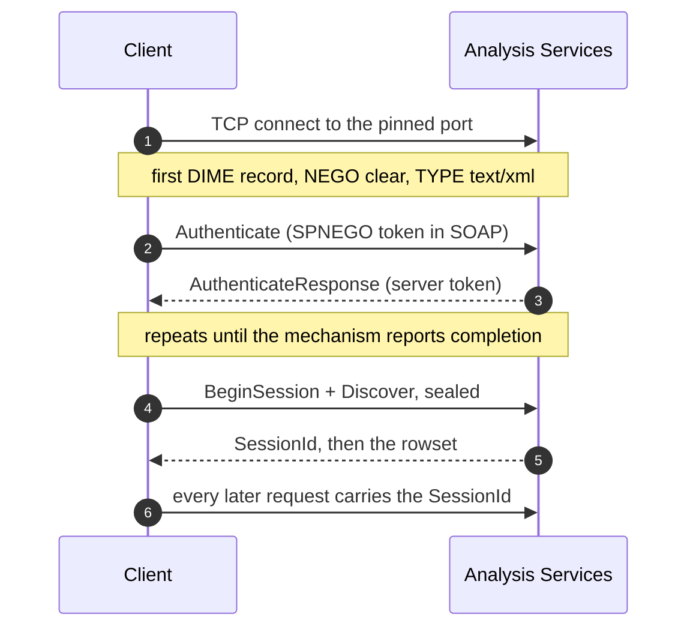

# Connecting

A session is opened by `connect()`, which does three things before it returns: it opens the
socket, negotiates the message encoding, and completes the security handshake. If any of them
fails it raises — so a returned `Session` is always usable, and there is no half-open state a
caller has to check for.

```python
from ssas_xmla import Credential, connect

with connect("ssas.example.com", 2383, Credential(mechanism="ntlm"), timeout=30.0) as session:
    ...
```

## The lifecycle



Three details in that picture are load-bearing and easy to get wrong:

- **`Authenticate` uses a different XML namespace** from `Discover` and `Execute`:
  `http://schemas.microsoft.com/analysisservices/2003/ext`, not the XMLA namespace. A live
  server rejects the wrong one outright.
- **The handshake is sent unsealed; everything after it is sealed.** The server enforces this.
  An unsealed post-handshake message is dropped with no error and nothing in its log.
- **The `SessionId` the server hands back to `BeginSession` must be carried on every later
  request.** Without it the client re-sends `BeginSession` forever and opens a new server-side
  session per request.

## The target

```python
from ssas_xmla import ConnectionTarget

ConnectionTarget(host="ssas.example.com", port=2383, timeout=30.0)
```

**There is no default port**, deliberately. A default would invite guessing between a default
instance's well-known 2383 and a named instance's pinned port, and guessing wrong presents as
a hang rather than as an error.

`timeout` must be positive. There is no option to disable it: every network wait in the
library is bounded by it, and an unbounded wait is not offered at any layer.

## Addressing

Instances are addressed by **host and a pinned port**. The named-instance redirector on TCP
2382 is not used, for a reason worth stating plainly:

- [MS-SSSO] routes named-instance resolution to SSRP [MC-SQLR] — but SSRP "is always
  implemented on top of the UDP Transport Protocol", so it covers the database engine on UDP
  1434, **not** the Analysis Services redirector on TCP 2382.
- No public Open Specifications document appears to define the TCP 2382 exchange. Product
  documentation describes the behaviour but not the wire format.
- It was tested: the redirector on 2382 does **not** speak the [MC-SQLR] framing.

Pinning the port removes the problem at no cost. Set `Port` in the instance's `msmdsrv.ini`
and restart it; a firewall rule is needed either way.

```ini
; msmdsrv.ini
<Port>2383</Port>
```

## Credentials

```python
Credential(
    mechanism="kerberos",   # or "ntlm", or "negotiate"
    principal=None,         # None means the ambient identity
    service="MSOLAPSvc.3",
    instance=None,          # a named instance, if the SPN is registered that way
    use_port=False,         # ask for MSOLAPSvc.3/host:port, as ADOMD does on SSPI
    spn=None,               # full override, service class included
)
```

`Credential` **has no password field.** Where NTLM needs one — a standalone server, with no
ambient identity — it is passed to `connect(..., password=...)`, handed straight to the
security layer, and never retained. That is what keeps `repr()` and every log line safe by
construction rather than by discipline.

The `service` / `instance` / `use_port` / `spn` fields shape the SPN that is requested. NTLM
ignores the SPN entirely; Kerberos does not, and the default here departs from the reference
client on purpose — see [Kerberos](./kerberos.md#the-spn).

## Closing

`Session.close()` releases the socket and the security context. It is **idempotent**, and
closing an already-failed session is not an error. Use the session as a context manager and
this is handled.

Reopening the same `Session` object is supported: `open()` resets everything scoped to a
connection — the negotiation bit, the security context, the `SessionId` — and closes the old
stream first. That last part matters more than it looks: overwriting the stream instead of
closing it leaked the socket for the life of the process, and against a real server left the
server-side session open too.

## Next

- [NTLM](./ntlm.md) — the mechanism that is verified end to end
- [Kerberos](./kerberos.md) — expected to work, and precisely what is not yet proven
