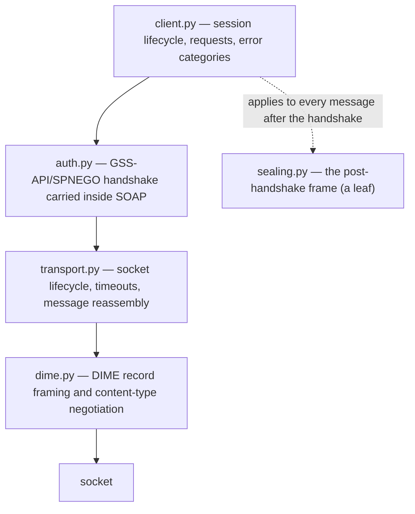

# The protocol

The whole design follows from one constraint: everything must be implementable from the
Microsoft Open Specifications and testable without a server. Where those pull against each
other — a binary protocol is not obviously testable offline — the [byte seam](#testability-the-byte-seam)
is how they are reconciled.

## The layers

Strictly bottom-up. No lower layer imports a higher one.

`sealing.py` is **not** in that stack. The handshake is deliberately sent unsealed, and
`sealing.py` imports only `errors` — it is a leaf that `client.py` applies to every message
*after* the handshake, on the way into `transport.py`.

`envelopes.py` (SOAP construction), `rowset.py` (response parsing), `redact.py` (scrubbing)
and `errors.py` (the failure categories) are used across layers and depend on nothing but the
standard library.

## What the specification pins down

**Framing.** [MS-SSAS] requires Direct Internet Message Encapsulation on TCP. The record
layout is fully specified, down to the padding rule that makes naive readers desync — see
[DIME framing](./framing.md).

**Content type.** Binary XML ([MS-BINXML]) and XPRESS compression are **optional** and
negotiated through the first `OPTIONS` byte. A client may therefore negotiate `text/xml` and
skip both entirely. That single fact is what makes this library small — and it is also the
project's largest assumption; see [the negotiation](./framing.md#content-type-negotiation).

**Authentication.** An authenticated or encrypted TCP connection must use GSS-API [RFC4178]
(SPNEGO), with security tokens carried **inside SOAP**: `Authenticate` out,
`AuthenticateResponse` back, repeating until the mechanism reports completion. One loop serves
Kerberos and NTLM because the specification's exchange is mechanism-agnostic, and `pyspnego`
presents the same shape.

**Operations.** `Authenticate`, `Discover` and `Execute` — the same three the HTTP binding
uses, so the SOAP envelopes and all response parsing are shared between bindings.

## What the specification does not cover

**The post-authentication frame.** [MS-SSAS] does not document it at all. Every message after
the handshake is sealed and wrapped in a 4-byte header that appears in no specification. It
was recovered by decompiling `AdomdClient`, and getting one field of it backwards is silently
fatal — the server closes the connection with no error and logs nothing. This is the layer
that took the longest; it has [its own page](./sealing.md).

**Named-instance resolution.** [MS-SSSO] routes it to SSRP [MC-SQLR], but SSRP is always over
UDP, so it covers the database engine on UDP 1434, not the Analysis Services redirector on TCP
2382. No public document appears to define the 2382 exchange, and it was tested empirically
**not** to speak [MC-SQLR] framing. Hence [pinned ports](../connection/index.md#addressing).

## How messages get split

Three independent splits can apply to one message, each handled at a different layer, and they
compose:

| # | Split | Layer | Boundary |
|---|---|---|---|
| 1 | sealed-frame chunking | `sealing.py` | payload longer than `MAX_CHUNK` (2888) becomes several frames, each with its own header, ciphertext and token |
| 2 | DIME record chunking | `dime.py` | `CF` on all but the last record, `MB` on the first, `ME` on the last; a chunked sequence never spans messages |
| 3 | TCP fragmentation | `transport.py` | reads driven by declared lengths, never by the peer going quiet; the buffer persists across calls |

What was actually observed against a live instance: `DBSCHEMA_COLUMNS` on a modest model
returned over 1300 rows, and that response was sealed into many frames (layer 1) and arrived
over many socket reads (layer 3). Whether the server *also* split it across DIME records was
not recorded — `DATA_LENGTH` is a `uint32`, so there is no row count at which layer 2 must
engage; chunking there is the sender's choice. The composition of all three is pinned by a
test rather than by that run.

## Testability: the byte seam

`transport.Channel` is a protocol with `send` / `recv` / `close`. The default implementation
wraps a real socket; tests supply recorded bytes. Everything above the socket is therefore
ordinary unit-testable code, and the suite runs **with sockets disabled** — no stub server to
keep in sync, no live instance required.

Handshake fixtures are **synthesized, never captured**. A real GSS/SPNEGO token carries the
principal, the realm, the target service and often the machine name; a committed capture would
be a disclosure that merely looks like an opaque blob, and no scrubber can reliably redact
arbitrary token structure. Captures of *post*-authentication traffic are permitted, and are
scrubbed.

## Normative references

| Document | Section |
|---|---|
| [MS-SSAS] | [TCP](https://learn.microsoft.com/en-us/openspecs/sql_server_protocols/ms-ssas/f172a52f-f69e-4051-8b3a-627433e978fb) |
| [MS-SSAS] | [Authentication and Encryption](https://learn.microsoft.com/en-us/openspecs/sql_server_protocols/ms-ssas/be84959b-ec40-4f5a-b18b-b271b0901668) |
| [MS-SSAS] | [Transport](https://learn.microsoft.com/en-us/openspecs/sql_server_protocols/ms-ssas/cc9c04c8-df61-40aa-b9bf-49d06b3ac888) |
| [MS-SSSO] | [Analysis Services](https://learn.microsoft.com/en-us/openspecs/sql_server_protocols/ms-ssso/e8ec30a5-3c27-478b-9921-74e0d4d7f12b) |
| [MS-SSSO] | [Named SQL Server Instance Resolution](https://learn.microsoft.com/en-us/openspecs/sql_server_protocols/ms-ssso/0a4ddedb-9121-4908-b721-ad8f0958f728) |
| [MC-SQLR] | [SQL Server Resolution Protocol](https://learn.microsoft.com/en-us/openspecs/windows_protocols/mc-sqlr/1ea6e25f-bff9-4364-ba21-5dc449a601b7) |
| [MS-BINXML] | [Binary XML](https://learn.microsoft.com/en-us/openspecs/sql_server_protocols/ms-binxml/) |
| [RFC4178] | [SPNEGO](https://www.rfc-editor.org/rfc/rfc4178) |
