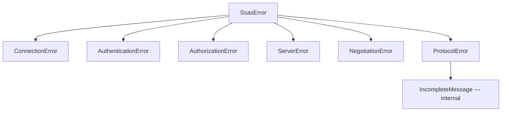

# Errors

Errors are **distinct types, not one error with a code**, because they demand different
operator actions: a connection failure means check the network, an authentication failure
means check the ticket, an authorization failure means check permissions. Collapsing them
would force every caller to parse message text.

```python
class SsasError(Exception):
    message: str
    detail: str | None     # the server's own explanation, scrubbed
```



## `ConnectionError`

Never reached a server. Check host, port and firewall.

Note this **shadows the builtin `ConnectionError`** inside the package, deliberately: it
mirrors the failure category, and a caller importing it from `ssas_xmla` gets the SSAS one.

*Probe exit code: 2.*

## `AuthenticationError`

Reached the server; identity could not be established.

Under NTLM: check the account and `$SSAS_PASSWORD`. NTLM ignores the SPN entirely, so the
`--instance` / `--use-port` / `--spn` flags cannot change the outcome.

Under Kerberos: check the ticket or keytab — **and the SPN**, which must match how the
instance is registered. The probe names the SPN the run actually asked for, so a mismatch is
visible rather than inferred.

A fault raised *during the handshake* is categorised here rather than as `ServerError`,
including one carried in the terminal `AuthenticateResponse` — see
[NTLM](../connection/ntlm.md#why-the-terminal-response-is-still-checked).

*Probe exit code: 3.*

## `AuthorizationError`

Identity established; access refused. Check the account's permissions.

Distinct from an **empty rowset**, which means "nothing visible to this account" and is a
valid answer. A server that refuses raises; a server with nothing to show returns nothing.

*Probe exit code: 5.*

## `ServerError`

The server understood the request and rejected it. Read `detail` — it carries the server's own
text, scrubbed and truncated to 300 characters. A malformed query lands here.

*Probe exit code: 6.*

## `NegotiationError`

The server declined the message encoding this client asked for.

This is its own category because it is not an ordinary failure. The library negotiates
clear-text XML so it can skip [MS-BINXML] and XPRESS compression entirely; a refusal means
that assumption is wrong, [MS-BINXML] moves from out-of-scope to required, and **the project's
scope changes**. It surfaces loudly rather than being retried around.

If you hit this against a real server, it is worth an issue: it is the one outcome the design
is not built for.

*Probe exit code: 4.*

## `ProtocolError`

The bytes on the wire did not match what the specification requires.

Two cases worth recognising:

- **"padded the plaintext"** — the negotiated mechanism pads, and [the frame has no field for
  the unpadded length](../protocol/sealing.md#why-padding-cannot-be-framed). Retry with
  `--mechanism ntlm`. The probe prints this hint.
- **"not an XMLA envelope"** — the response unsealed to something that is not XML. The
  security context or the frame layout is wrong. This is raised rather than returning an empty
  rowset, because an empty rowset is a meaningful answer and the likeliest cipher-layer failure
  produces exactly that indistinguishable emptiness.

`IncompleteMessage` subclasses `ProtocolError` and means "read more, retry" — it is internal
to the reader and does not reach a caller. It is a distinct **type** rather than a flag
because the reader has to tell "keep reading" from "this is malformed", and doing that by
matching message text was a real defect: a chunked message split at a record boundary is
incomplete but says nothing about truncation, so it was treated as fatal.

*Probe exit code: 7.*

## Nothing identifying is emitted

At any level, in any message: no credential, security token, host, address, account,
principal, realm, machine name or security identifier appears in a log line or an error.

`detail` is scrubbed on the way in. The scrubbing is anchored to **real service-principal
classes** rather than a generic `word/word` shape, because a generic pattern destroyed the
diagnostics it was meant to preserve — turning `text/xml` and `Envelope/Body` into `<SPN>`.

A CI gate scans every tracked file in the repository for those token classes, so a fixture or
a doc page cannot reintroduce one.
